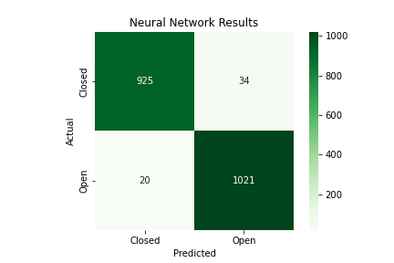
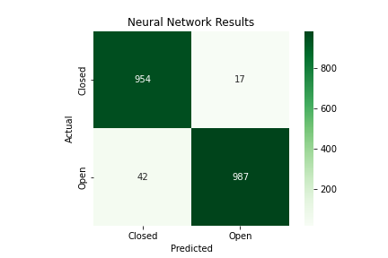
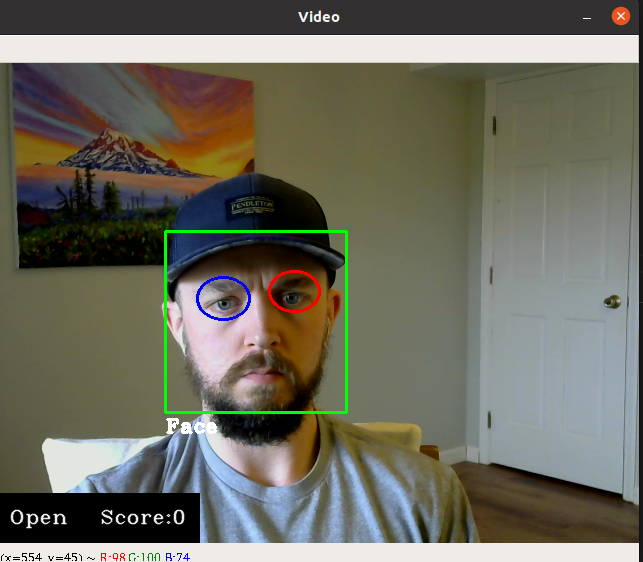
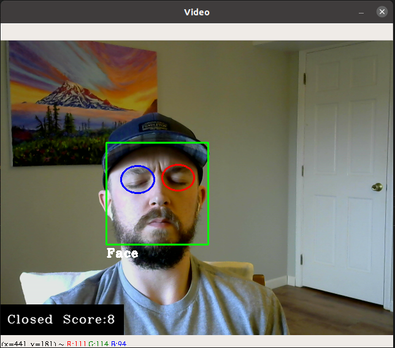

## Drowsiness Detection

The base purpose of the drowsiness detection system is to create a neural network that will determine if an eye is open or closed. A convolutional neural network was constructed using 5,000 images of open eyes and 5,000 images of closed eyes, in grayscale. A basic network was able to achieve an accuracy of 97.3%. The confusion matrix for the basic network is shown below.

After constructing a basic network, transferred learning was tested to see if performance could be increased. The mobilenet architecture and imagenet weights were used for the base of the transferred learning model. After implementing a new top layer and resizing the dataw, an accuracy of 97.05% was achieved. This model had much more complexity when compared to the basic model and will not be used in production. 

The final stage of the project is currently being implemented. OpenCV is used to detect a face and the right and left eye individually using a webcam. Each frame from the webcam is turned into an image and the eyes are isolated and sent to the basic neural network for classification. If both eyes are classified as closed a counter will increment up. If this counter reaches 10 a siren alarm is raised.

Image showing webcam when eyes are open, counter at zero.

Image showing webcam when eyes are closed, counter increasing.
